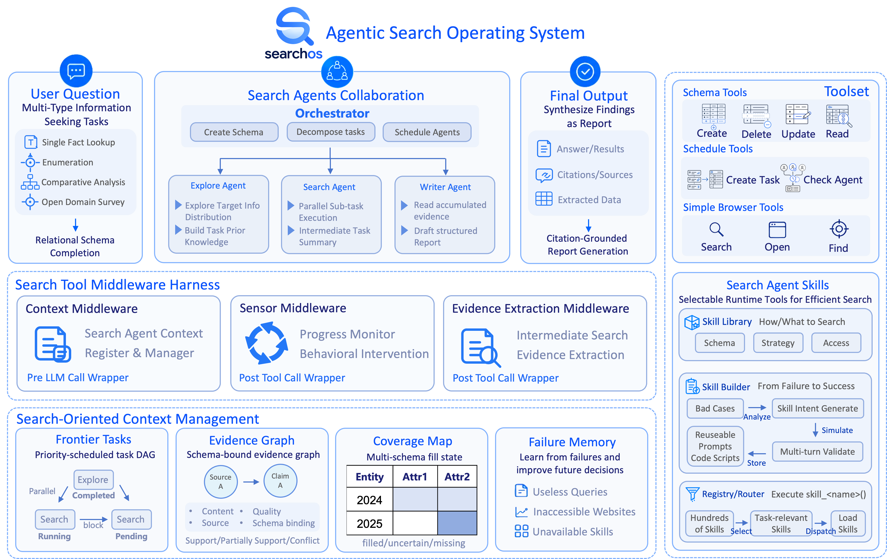
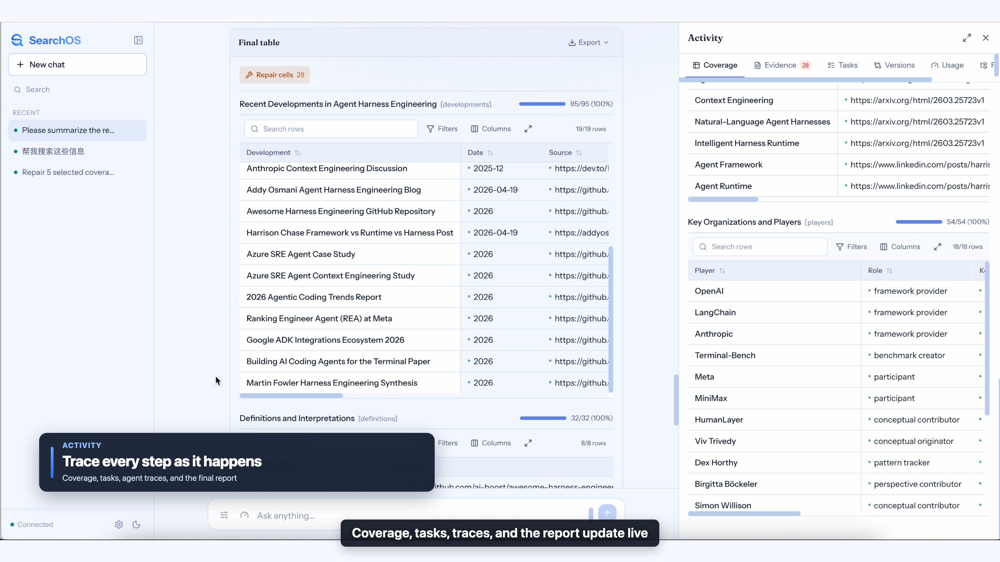
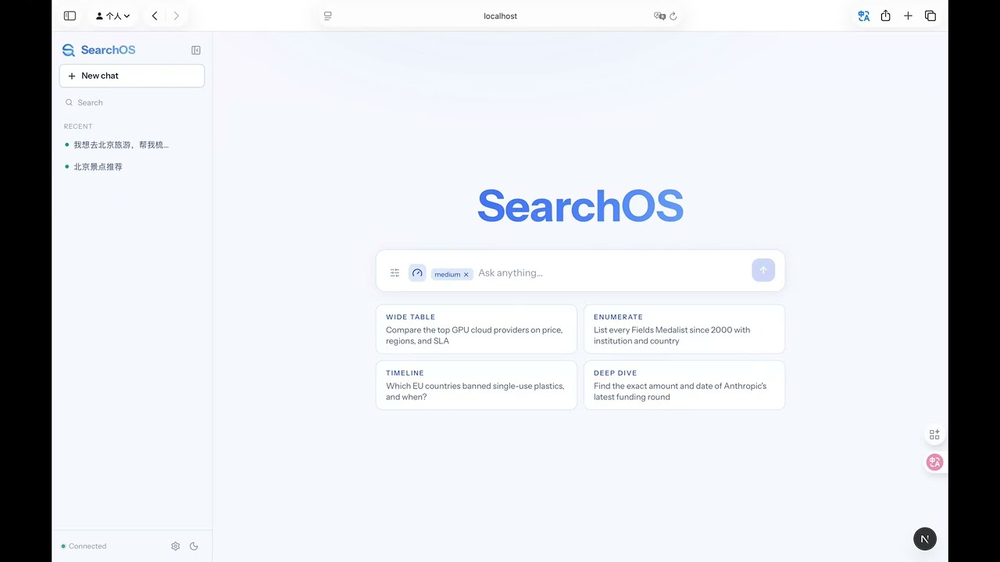
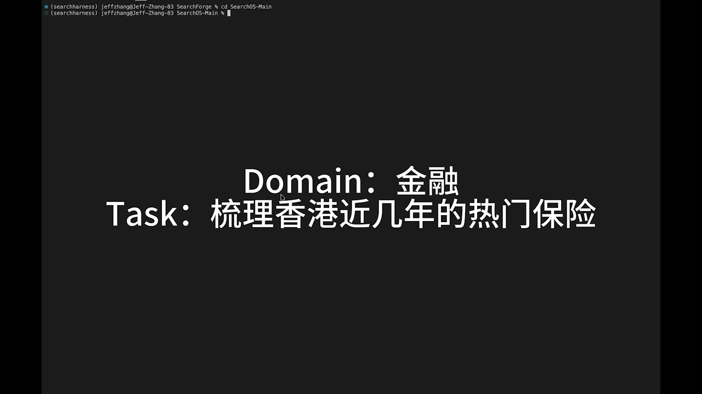
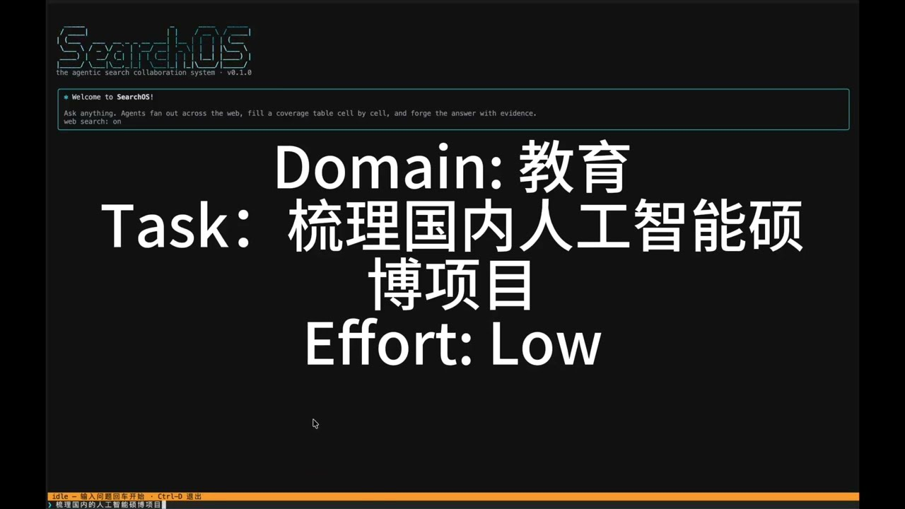
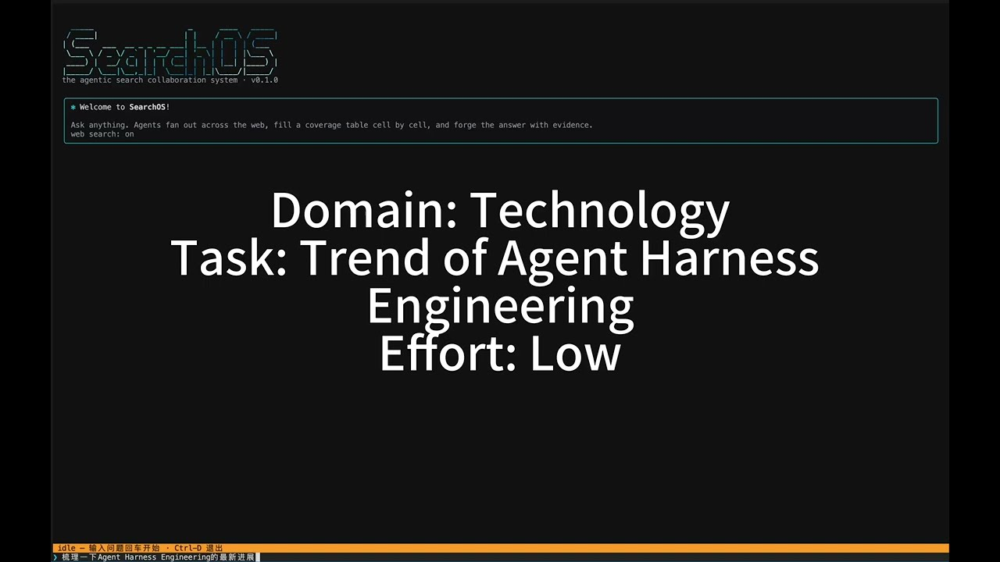
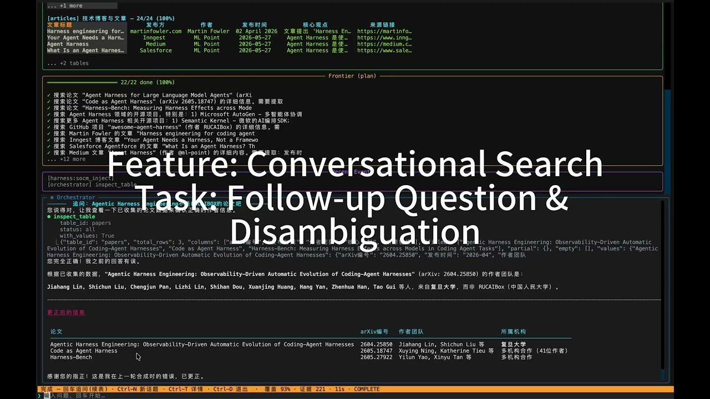
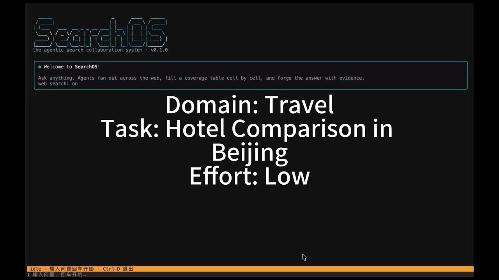

<div align="center">

[中文](docs/README.zh.md) | **English** | [日本語](docs/README.ja.md) | [한국어](docs/README.ko.md)

</div>

<p align="center">
  
</p>

<h3 align="center">A multi-agent collaboration system for open-domain information seeking</h3>

<p align="center">
  <a href="https://antins-labs.github.io/SearchOS/"></a>
  <a href="https://www.python.org/"></a>
  <a href="https://github.com/langchain-ai/langgraph"></a>
  <a href="https://github.com/Textualize/textual"></a>
  <a href="LEGAL.md"></a>
</p>

<p align="center">
  <i>Schedule search the way an operating system schedules processes: compile an open-domain question
  into a normalized coverage map, dispatch its empty cells to pipelined-parallel sub-agents,
  write every piece of evidence — with its source — into a shared evidence graph, and synthesize
  a citation-grounded answer from <b>search state</b> — state that lives in the system, not in conversation history.</i>
</p>

<p align="center">
  
</p>

<p align="center">
  <a href="https://youtu.be/DZNXxMcxnMQ">
    
  </a>
</p>

<p align="center">
  🎬 <b><a href="https://youtu.be/DZNXxMcxnMQ">Full demo video (YouTube)</a></b>
</p>

<p align="center">
  <a href="https://youtu.be/wxy74AqykwY" title="Watch the narrated SearchOS product walkthrough in English">
    
  </a>
</p>

<p align="center">
  🎬 <b><a href="https://youtu.be/wxy74AqykwY">Full product walkthrough (English)</a></b>
  <br><sub>English narration and subtitles · Setup, schema building, verifiable evidence, repair, and export</sub>
</p>

> **▶️ Quick run:**
>
> ```bash
> pip install -e . && python -m searchos "Top-5 universities per subject in the 2025 QS rankings, with application deadlines"
> ```
>
> The first run launches a **setup wizard**: pick a model provider (vendor coding plans / pay-as-you-go APIs / local deployment), paste an API key, and you're up.
> Or run `python -m searchos` for the full-screen TUI to watch task dispatch, tool streams, and the coverage map grow in real time.
> You can also run `./web/start.sh` to bring up the REST/WS API (`:8000`) + web frontend (`:3000`) and launch searches from the browser with a live agent wall and coverage map.

## 📣 News

- **2026-07-11** — **Start faster. Search wider. See every step.** A new one-command installer gets SearchOS running; parallel Explore waves scout the web in batches, while live progress and evidence grouped by entity make every discovery easier to follow. Skills now run in hardened, isolated workers. ⚡
- **2026-07-10** — **A whole new way to research.** Draw the structure of your question. SearchOS turns it into citation-backed research you can explore, refine, and export. 🧩
- **2026-07-09** — **Pick up exactly where you left off.** Every session returns with its conversation, progress, evidence, and live activity intact. ⏪
- **2026-07-08** — **Everything in one place.** Models, providers, search, skills, and budgets now come together in one beautifully simple control center. ⚙️
- **2026-07-07** — **SearchOS is now open source.** Multi-agent search, structured research, TUI, and Web UI. All together. Ready for everyone. 🚀

## ✨ Highlights

- 🗂️ **Search state as a system asset** — SOCM (Search-Oriented Context Management) keeps the task queue, evidence graph, and coverage map in one persistent state shared by all agents: snapshot, restore, replay — nothing drowns in conversation history.
- 🧩 **Coverage-map-driven, recall-first** — the question becomes normalized entity × attribute tables; dispatch keeps targeting empty cells until every one holds a sourced value.
- ⚡ **Pipelined-parallel sub-agents** — search → open → find stages overlap across agents; wall-clock approaches the slowest single chain, not a serial sum.
- 🔗 **Every cell carries a citation** — extraction middleware writes (entity, attribute, value, source) into the evidence graph; every answer traces back to its source.
- 🛡️ **Sensor safety net** — five kinds of loop / stall detection on every tool call: remind first, re-dispatch from a new angle if it persists.
- 🧰 **Skills + multi-provider out of the box** — access skills crack anti-bot / login-walled sites, strategy skills handle rankings / multi-hop / disambiguation; `SF_PROVIDER` connects any vendor in one line.

> 📊 Leads on all headline F1 metrics on **WideSearch / GISA**, including **Set · F1 +13.4 over the next-best baseline** on enumeration questions (see [Evaluation](#-evaluation)).

## 🎥 Gallery

<table align="center">
  <tr>
    <td width="50%" align="center">
      <a href="https://youtu.be/dfzu9aeK0Cs" title="SearchOS-Web Demo · Watch on YouTube">
        
      </a>
      <sub>▶️ <b>SearchOS-Web Demo</b></sub>
    </td>
    <td width="50%" align="center">
      <a href="https://youtu.be/bS07neJm6FA" title="SearchOS-Web Demo 2 · Watch on YouTube">
        
      </a>
      <sub>▶️ <b>SearchOS-Web Demo 2</b></sub>
    </td>
  </tr>
  <tr>
    <td width="50%" align="center">
      <a href="https://youtu.be/YhJdc7Qhr1U" title="SearchOS-demo1 · Watch on YouTube">
        
      </a>
      <sub>▶️ <b>SearchOS-demo1</b></sub>
    </td>
    <td width="50%" align="center">
      <a href="https://youtu.be/Qve7GX7yahs" title="SearchOS-demo2 · Watch on YouTube">
        
      </a>
      <sub>▶️ <b>SearchOS-demo2</b></sub>
    </td>
  </tr>
  <tr>
    <td width="50%" align="center">
      <a href="https://youtu.be/IA_-sO2avTA" title="SearchOS-demo3 · Watch on YouTube">
        
      </a>
      <sub>▶️ <b>SearchOS-demo3</b></sub>
    </td>
    <td width="50%" align="center">
      <a href="https://youtu.be/HxCLoauXoYg" title="SearchOS-demo4 · Watch on YouTube">
        
      </a>
      <sub>▶️ <b>SearchOS-demo4</b></sub>
    </td>
  </tr>
  <tr>
    <td colspan="2" align="center">
      <a href="https://youtu.be/-QmjRr_3B1s" title="SearchOS-demo5 · Watch on YouTube">
        
      </a>
      <br><sub>▶️ <b>SearchOS-demo5</b></sub>
    </td>
  </tr>
</table>

<p align="center"><sub>Click a cover to watch on YouTube (more demos coming)</sub></p>

<!-- To add a video: copy a <td>…</td> block above and swap the youtu.be link, assets/gallery thumbnail, and title -->

## 💡 Why SearchOS

Pointing a general-purpose agent or deep-search agent at long-horizon search tasks commonly produces these failure modes:

* **Opaque process** — intermediate search results drown in dozens of turns of conversation history; facts get lost after context compression; mid-run you can neither see progress nor resume or replay.
* **Easy to loop** — no memory of what has already been checked: the same query gets re-issued with different phrasing, and the same entity's attributes are searched again in different subtasks.
* **Blurred roles** — sub-agents must search, read, remember, and summarize all at once; on long tasks something always slips: extracted fields use inconsistent conventions, sources get dropped.
* **Can't get in, can't search well** — anti-bot walls, login gates, and deep directories keep hard sites unreachable; ranking, multi-hop, and disambiguation questions aren't solved by simply searching more.

SearchOS answers each of the four failures with a mechanism-level fix:

* **Search state lives in the system, not in conversation history** — SOCM keeps the task queue, evidence graph, and coverage map in one shared persistent state (`search_state.json`): snapshot, restore, replay at any time; sub-agents run on a three-layer context (SOCM snapshot → episodic summaries → recent working memory) instead of full history, keeping a stable prompt-cache-friendly prefix.
* **Entity-centric modeling + loop-breaking sensors** — a normalized multi-table schema (primary keys + attributes, with foreign keys) means each fact is fetched once and dispatch always targets empty cells; LoopSensor runs five loop checks on every tool call — remind first, mark `looped` and re-dispatch from a different angle if it persists.
* **Search and extraction are separated** — sub-agents just find the right pages; on every page open, a judge model extracts (entity, attribute, value, source, confidence) into the evidence graph, with unit normalization and excerpts anchored to the original text — consistent conventions, traceable sources.
* **Skills for hard sites, methodology for hard questions** — the first skill system purpose-built for search agents: access skills solve "can't open" (anti-bot / login walls), strategy skills solve "don't know how to search" (rankings / multi-hop / disambiguation), routed per query (details in [Skill system](#-skill-system)).

## 🧩 Framework

```
User query
   │
   ▼
┌─────────────────────────── Orchestrator (sole decision maker) ───────────────────┐
│   Explore scouting → create_schema builds the coverage map → enqueue_tasks       │
│   dispatch → check_agents polling → assess/adjust → enough coverage or budget    │
│   exhausted → synthesize                                                         │
└──────┬──────────────────────────┬─────────────────────────────┬──────────────────┘
       ▼                          ▼                             ▼
  explore_agent              search_agent × N              writer_agent
 (query typing / hub pages / (searches the web per         (consumes SOCM, writes
  candidate entities /        subtask, never writes         cited sections)
  search plan)                state directly)
       │                          │                             │
       └────────────┬─────────────┴─────────────────────────────┘
                    ▼
      Three middleware layers: Context → Sensor → Extraction
     (prompt assembly / budget & loop monitoring / judge-based auto extraction)
                    │
                    ▼
┌──────────── SOCM · Search-Oriented Context Management (shared search state) ────┐
│  Frontier Memory   task queue: priority + blocked_by DAG, three task types in   │
│                    one shared pool                                              │
│  Evidence Graph    findings / sources / confidence, support-conflict edges      │
│  Coverage Map      entity × attribute, multi-table + foreign keys, per-column   │
│                    types / formats / validation                                 │
│  Strategy Memory   strategy & failure memory · Writer Outline · Budget          │
└─────────────────────────────────────────────────────────────────────────────────┘
```

A session loops through six steps:

1. **Explore** — a scout goes first: classifies the query type, locates hub pages, produces candidate entities and a search plan; it does not extract attribute values.
2. **Schema** — the Orchestrator builds a normalized coverage map by entity type (multiple tables + relations); every entity Explore found is seated as a seed row.
3. **Dispatch** — gaps are split into self-contained natural-language subtasks and dispatched to search agents in parallel by priority and dependency.
4. **Extract** — after every page open, the Extraction middleware automatically extracts (entity, attribute, value, source, confidence) into the evidence graph and lights up the coverage map.
5. **Assess** — subtasks are polled and harvested: new entities join the table, bad sources are blacklisted, conflicts go to arbitration, empty cells get targeted follow-ups.
6. **Synthesize** — once the coverage self-check passes, the answer is joined out of SOCM in the user's requested format, citation by citation.

### What the output looks like

Every cell carries a back-anchored source number, with the sources listed at the end — this is what "citation-grounded relational schema completion" looks like in the final product (excerpt from a real run; the query, in Chinese, was *survey Hong Kong's popular insurance products in recent years*):

```markdown
### Major insurers in Hong Kong
| Company     | English name   | 2024 APE rank | 2023 premiums  |
|-------------|----------------|---------------|----------------|
| 友邦保险     | AIA [6]        | #1 [6]        | HK$87.1B [6]   |
| 保诚         | Prudential [6] | #2 [6]        | HK$65.3B [6]   |
| 汇丰保险     | HSBC Life [6]  | #3 [6]        | HK$55.5B [6]   |
| 宏利         | Manulife [6]   | #4 [6]        | HK$49.8B [6]   |

### Sources
[6] https://www.ia.org.hk/tc/infocenter/press_releases/20250425.html, https://inews.hket.com/…
```

The full artifact (a replayable directory with the trajectory, page cache, and SOCM state) lives under `searchos_workspace/<timestamp>/`.

## 🚀 Installation

Requires Python ≥ 3.11:

```bash
./install.sh                # 一键安装：Python、Access Skill、Chromium 与 Web 前端
source .venv/bin/activate

pip install -e .            # base dependencies (incl. OpenAI/Anthropic dual-protocol clients; coding plans work out of the box)
pip install -e ".[access]"  # bundled Access Skill executors
pip install -e ".[eval]"    # evaluation: pandas / numpy / python-dotenv
pip install -e ".[all]"     # all optional runtime dependencies
```

中文完整说明见 [`docs/installation.md`](docs/installation.md)。

## ⚙️ Configuration

**The first run launches a setup wizard automatically**: when no usable model configuration is detected, `python -m searchos` walks you through picking a provider and entering an API key on the command line, then writes `.env` (re-run anytime with `python -m searchos --setup`).

You can also configure manually — copy [`.env.example`](.env.example) to `.env`, pick one `SF_PROVIDER` preset, and add the matching API key (bindings for all 12 model roles are generated automatically):

```bash
# Vendor Coding Plan (Anthropic-protocol subscription endpoints, great value)
SF_PROVIDER=zhipu-coding      # or kimi-coding / minimax-coding / qwen-coding / volcengine-coding
ZHIPU_API_KEY=xxx

# Or pay-as-you-go API (OpenAI protocol)
SF_PROVIDER=deepseek          # or moonshot / dashscope / openai / openrouter / siliconflow / gemini ...
DEEPSEEK_API_KEY=xxx

# Or local deployment
SF_PROVIDER=ollama            # or vllm
SF_MODEL=qwen3:32b

SF_JINA_API_KEY=...           # optional: Jina fetching (without it you use the unauthenticated quota, prone to 429)
```

All presets (each vendor's endpoints, model IDs, how to get keys, and known quirks) are in [`docs/providers.md`](docs/providers.md). Without `SF_PROVIDER`, the built-in gateway defaults in [`searchos/config/settings.py`](searchos/config/settings.py) apply (`OPENAI_API_KEY` + `SF_EXTRACTION_API_KEY`).

All configuration is centralized in `settings.py`; `SF_`-prefixed environment variables override it, with `__` separating nested fields (partial overrides **deep-merge** with defaults, changing only the fields you set). Models are bound by **role** (12 roles → model profiles), which makes ablations and cost reduction easy:

| Common settings | Description |
| --- | --- |
| `SF_MODEL` / `SF_FAST_MODEL` | Override the preset's main / lightweight-tier model |
| `SF_API_BASE` | Override the endpoint (e.g. switch to the international domain) |
| `SF_SEARCH_PROVIDER` | Search backend: `serper` \| `tavily` \| `ragflow` (inferred from available keys if unset) |
| `SF_BROWSER_BACKEND` | Fetch backend: `jina` \| `aiohttp` \| `crawl4ai` \| `search_engine` |
| `SF_ROLES__JUDGE=main` | Rebind a single role's model profile (advanced / ablation) |
| `SF_PROFILES__MAIN__TEMPERATURE=0.3` | Field-level override on one profile (advanced / ablation) |
| `SF_MAX_PARALLEL_AGENTS` | Sub-agent concurrency cap (default 8) |
| `SF_ENABLE_EXPLORE` / `SF_ENABLE_SKILLS` | Ablation switches: disable scouting / disable skills |
| `SF_SKIP_SYNTHESIS` | Evaluation mode: skip synthesis and export the table straight from the coverage map |

## 🧭 Quick start

| Command | What it does |
| --- | --- |
| `python -m searchos "<query>"` | Single query; results land in `searchos_workspace/<timestamp>/output/report.md` |
| `python -m searchos` | Full-screen Textual TUI: live panels, mid-run steering, multi-turn follow-ups, `/skill` skill management |
| `python -m eval.run --benchmark widesearch --range 1-50` | Run evaluations (see the next section) |

### Interactive TUI

`python -m searchos` opens the full-screen interface: a live dashboard on top (task dispatch, sub-agent status, coverage map growth) and the tool stream below. One input box routes by timing:

| When | What typing natural language does |
| --- | --- |
| Idle | Starts a new search run |
| **Mid-run** | **Live steering** — your text is injected into the running Orchestrator immediately, without interrupting sub-agents; use it to add constraints ("2024 data only"), correct course, or point at good sources |
| After a run | **Multi-turn follow-up** — reuses the previous round's coverage map and evidence: if the answer is already in the table it is answered directly (no new search); otherwise the existing table is extended incrementally, never rebuilt from scratch |

Slash commands work at any time (including mid-run):

| Command | Alias / shortcut | What it does |
| --- | --- | --- |
| `/new` | `/clear` · `Ctrl-N` | New topic: clears conversation history and the coverage map; the next question starts from a fresh workspace |
| `/effort [low\|medium\|high\|max]` | — | Effort tier: adjusts iteration cap, concurrency, per-agent search budget, wall-clock limit, and skill-routing top-k in one go; with no argument it opens an interactive picker; mid-run changes take effect next round |
| `/skill` | — | Skill management: no argument opens a grouped multi-select dialog; subcommands `list`, `only <names…>` (whitelist, fuzzy prefix match), `on` / `off <names…>`, `all` (reset to router control) for fine-grained control |
| `/verbose` | `/detail` · `Ctrl-T` | Toggle compact / detailed tool stream |
| `/stop` | `/cancel` · `Esc` | Interrupt the current run (Esc exits the program when idle) |
| `/help` | `/?` | Command help |
| `/quit` | `/exit` · `Ctrl-D` | Exit SearchOS |

The four `/effort` budget tiers at a glance (these modify global settings and take effect immediately for the current session; parallel sub-agents stay fixed at 8 across tiers):

| Tier | Orchestrator iterations | Searches per agent | Wall-clock cap | Routing top-k |
| --- | :---: | :---: | :---: | :---: |
| `low` | 25 | 10 | 10 min | 20 |
| `medium` (default) | 50 | 20 | 30 min | 40 |
| `high` | 100 | 35 | 60 min | 60 |
| `max` | 150 | 50 | 120 min | 80 |

Design doc: [docs/tui-textual-redesign.md](docs/tui-textual-redesign.md).

## 🧰 Skill system

Three categories of skills, all under [`searchos/skills/library/`](searchos/skills/library/):

| Category | Count | Description |
| --- | --- | --- |
| **access** | 248 | Site-level data access, named by domain (e.g. `en_wikipedia_org`); auto-routed on URL match, or invoked proactively by sub-agents as typed tools |
| **strategy** | 40+ | Reasoning methodology: `ranking_top_n`, `entity_disambiguation`, `multi_hop_bridge`…, optionally with anti-pattern checklists |
| **orchestrator** | a few | Orchestration-level methodology, injected wholesale as a playbook |

At runtime an LLM router pre-filters the access catalog to a query-relevant top-k (fail-open); each dispatched sub-agent carries at most 3 skills; pages that match no access skill fall back to the generic extraction middleware.

```bash
SEARCHOS_SKILL_ONLY=en_wikipedia_org,ranking_top_n   # whitelist
SEARCHOS_SKILL_LAYERS_DISABLED=access                # disable by layer
SEARCHOS_SKILLS_DISABLED=1                           # disable all
```

After a session, high-frequency domains can optionally be mined and baked into new access skills automatically (`SF_ENABLE_ACCESS_SKILL_GENERATION`, off by default).

## 📊 Evaluation

On **WideSearch** (wide-table retrieval) and **GISA** (open-domain information seeking), compared against 2 single-agent baselines (ReAct / Plan-and-Solve) and 3 multi-agent systems (Table-as-Search / A-MapReduce / Web2BigTable). All scores are **max@3** (best of three runs per case, ×100); **bold** marks the best in each row. *Item* scores cells independently; *Row* requires a fully correct row.

| Benchmark | Metric | ReAct | Plan-and-Solve | Table-as-Search | A-MapReduce | Web2BigTable | **SearchOS** |
| --- | --- | :---: | :---: | :---: | :---: | :---: | :---: |
| WideSearch | Item · Precision | 82.9 | 83.8 | 82.4 | 83.1 | 78.3 | **83.9** |
| | Item · Recall | 70.2 | 72.9 | 73.5 | 74.2 | 73.4 | **79.7** |
| | Item · F1 | 72.9 | 75.2 | 75.4 | 76.0 | 73.8 | **80.3** |
| | Row · Precision | 58.0 | 58.7 | 57.1 | 56.9 | 57.5 | **59.0** |
| | Row · Recall | 48.8 | 50.2 | 51.6 | 49.8 | 54.0 | **55.8** |
| | Row · F1 | 50.9 | 52.2 | 52.7 | 51.4 | 54.5 | **56.5** |
| GISA | Table · Item · F1 | 74.8 | 71.2 | 73.4 | 72.5 | 68.1 | **76.9** |
| | Table · Row · F1 | 58.1 | 50.7 | 54.1 | 52.1 | 45.3 | **59.7** |
| | Set · F1 | 61.6 | 63.1 | 60.9 | 62.5 | 56.7 | **76.5** |
| | List · F1 | 67.1 | 53.8 | 54.2 | 57.4 | 65.5 | **68.1** |
| | Item · EM | 0.0 | 16.7 | 16.7 | 33.3 | **50.0** | **50.0** |

SearchOS leads on all F1 metrics across both benchmarks, with gains driven primarily by **recall** — coverage-map-driven dispatch keeps filling empty cells until every schema cell has a sourced value; on enumerating complete sets, **Set · F1 beats the next-best baseline by +13.4**.

## 🗂️ Project layout

```
searchos/
├── agents/        Orchestrator (prompt / catalog / scheduler / lifecycle) and the three sub-agent definitions
├── harness/       SearchSession main loop, three middleware layers, synthesis, trajectory & conversation logs
├── socm/          Shared search state: Frontier / Evidence Graph / Coverage Map / Strategy
├── tools/         Tools grouped by role: schema, tasks, writer, simple_browser …
├── skills/        Skill system: core contracts / catalog registry & routing / runtime execution / evolution / skill library
├── tui/           Textual full-screen interface (live dashboard, /skill management, follow-ups & steering)
├── config/        settings.py (pydantic-settings, SF_ prefix overrides) + model role bindings
└── cli.py         python -m searchos entry point

eval/              Evaluation framework: run.py entry, runner, benchmarks, scorers, reformat
datasets/          WideSearch / GISA / xbench / browsecomp / frames / webwalker
baselines/         Baselines for comparison (gpt-oss-simple-browser, etc.)
eval_results/      Evaluation output (one directory per case, with a fully replayable session)
searchos_workspace/ Session workspaces for interactive runs (timestamped directories)
```

## 🙏 Acknowledgements

SearchOS is designed and built by its core contributors, **Yuyao Zhang** and **Junjie Gao** (Ant Group), under the supervision of their advisors, **Ji-Rong Wen** and **Zhicheng Dou** (Renmin University of China). We also thank Ant Insurance for its strong support, and are especially grateful to **Kai Yang** and **Xingzhong Xu**, the initiators and leaders of this project.

## 📚 Citation

The paper (*SearchOS-v1*) is in preparation and its citation entry will replace this one upon release. Until then, if this project helps your research, please cite the repository:

```bibtex
@misc{searchos2026,
  title        = {SearchOS-v1: Towards Robust Open-Domain Information-Seeking Agents Collaboration},
  author       = {Zhang, Yuyao and Gao, Junjie and Wu, Zhengxian and Zhang, Jin and Ma, Shihan and Yao, Yao and Qi, Weiran and Xu, Xingzhong and Yang, Kai and Wen, Ji-Rong and Dou, Zhicheng},
  year         = {2026},
  howpublished = {\url{https://github.com/antins-labs/SearchOS}}
}
```

## 📄 License

MIT — see also [LEGAL.md](LEGAL.md).
